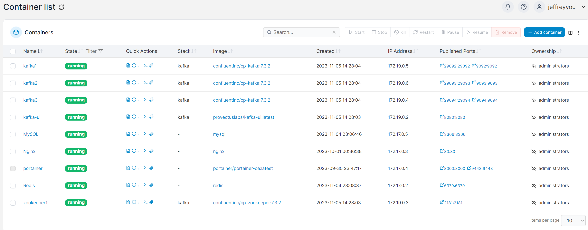
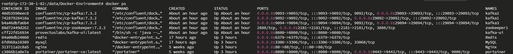

# WhatsApp Server

## Tech Stack
- Green API
- MySQL
- Redis
- MyBatis
- Docker
- Swagger
- Spring Boot
- Spring MVC
- Spring Security
- WebSocket
- Zookeeper
- Kafka

## Rate Limit
Assume each packet contains 150 bytes(150 characters), TTL = 40ms

The throughput of 3 partition kafka cluster will be  3 * 1000 *150 / 20 = 22500 bytes per second = 150 users

## Services

